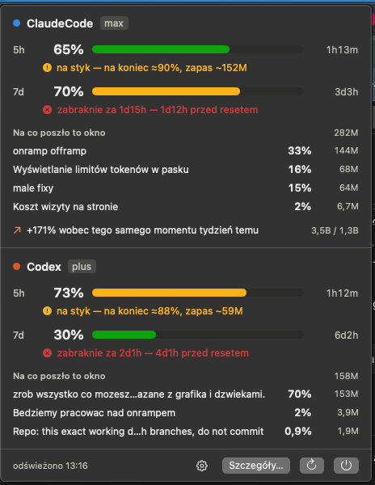

# AI Limits

Widget paska menu macOS, który odpowiada na jedno pytanie: **czy limit wystarczy mi do
resetu** — dla Claude Code i Codeksa naraz.


Procent zużycia, czas do resetu i prognoza na koniec okna. Kiedy okno ma wyschnąć przed
resetem, zamiast prognozy pojawia się alarm z godziną, o której skończą się tokeny.

## Panel



Kliknięcie rozwija panel z licznikami obu okien, werdyktem („starczy" / „na styk" /
„zabraknie za…") i listą sesji **wycenionych w procentach limitu**, a nie w tokenach —
procent jest walutą, w której się płaci. Na dole porównanie z tym samym momentem tydzień
wcześniej.

Przycisk *Szczegóły…* otwiera okno z wykresami: tokeny w godzinach, tydzień do tygodnia,
przebieg wykorzystania limitów, tabela modeli i rozwijana lista wątków.

## Instalacja

```bash
git clone https://github.com/matthew-butterfly19/ai-limits.git
cd ai-limits
./scripts/install.sh
```

Aplikacja ląduje w `/Applications` i startuje przy logowaniu. Odinstalowanie:
`./scripts/install.sh --uninstall` (baza statystyk zostaje nietknięta).

Wymaga macOS 14+ i Command Line Tools. Xcode nie jest potrzebny.

## Skąd biorą się dane

| Źródło | Co daje |
|---|---|
| `api.anthropic.com/api/oauth/usage` | limity Claude Code — okno 5 h, tygodniowe i osobne okna per model |
| `codex app-server` → `account/rateLimits/read` | limity Codeksa — okno 5 h i tygodniowe |
| `~/.claude/projects/**/*.jsonl` | tokeny per wątek, model, projekt, subagenci |
| `~/.codex/sessions/**/*.jsonl` | jw. plus historyczne próbki limitów z samych logów |

Token OAuth czytamy z Keychaina przy każdym odczycie i nigdzie go nie zapisujemy.
Wszystko inne zostaje na dysku, w SQLite pod `~/Library/Application Support/AILimits/`.
Poza dwoma zapytaniami o limity — do Anthropica i OpenAI, czyli tam, gdzie te limity i tak
są liczone — nic nie wychodzi na zewnątrz. Szczegóły w [SECURITY.md](SECURITY.md).

## Jak liczona jest prognoza

Samo tempo („3,1 %/h") niczego nie rozstrzyga — przy czterech godzinach do resetu jest
wygodne, przy jednej zabójcze. Dlatego tempo jest zawsze zestawione z **budżetem**:

```
budżet  = (100 − zużyte) / godziny do resetu
koniec  = zużyte + tempo × godziny do resetu
```

Dla okna 5 h tempo bierzemy z ostatniej godziny. Dla tygodniowego — ze średniej od
otwarcia okna, bo tempo z popołudnia rozciągnięte na trzy doby ignoruje noce i przerwy.
Poniżej trzech próbek prognozy nie ma wcale; projekcja z dwóch punktów to zgadywanka
w przebraniu pomiaru.

## Czego te liczby nie mówią

**Procent per sesja to udział w tokenach, nie zmierzony koszt.** Suma po sesjach zgadza się
z licznikiem okna co do procenta, ale podział między nie zakłada, że token kosztuje tyle
samo niezależnie od modelu. Dostawcy nie podają wag per model; żeby je oszacować, potrzeba
kilkunastu okien z próbkami — aplikacja zbiera je od pierwszego uruchomienia.

**Kompaktowanie kontekstu nie jest nigdzie policzone.** Wywołanie kompaktujące przeczytuje
całą rozmowę i kosztuje realne tokeny, ale Claude Code zapisuje rekord `compact_boundary`
bez bloku `usage`, a Codex — `token_count` z zerami. Limit to odczuwa, logi nie. Kompakty
trafiają więc do osobnej tabeli i są pokazywane obok sum, nigdy w nich (`--compactions`).

**Sumy są niższe niż `/stats` w Claude Code.** Claude zapisuje jedną odpowiedź modelu
w kilku liniach JSONL, powtarzając w każdej ten sam licznik zużycia. Deduplikujemy po
`(message.id, requestId)`; `/stats` liczy każdą linię osobno. Dla Codeksa kluczem jest
`(session_id, ordinal)`.

## Z terminala

Ta sama binarka działa jako narzędzie wiersza poleceń:

```bash
AILimits=/Applications/AILimits.app/Contents/MacOS/AILimits

$AILimits --limits        # limity na żywo
$AILimits --totals        # sumy tokenów per aplikacja
$AILimits --threads       # najcięższe wątki
$AILimits --models        # co który model daje za to, co zużywa
$AILimits --compactions   # kompakty kontekstu i ich szacowany koszt
$AILimits --ingest        # wczytaj nowe linie logów
$AILimits --backfill      # przejdź logi od nowa (bezpieczne, nic się nie dubluje)
```

`--db PATH` wskazuje inną bazę — tak sprawdzamy zgodność kolektora bez ruszania tej właściwej.

## Budowanie

```bash
./scripts/build.sh          # debug
./scripts/build.sh release
```

Dwie osobliwości stockowych Command Line Tools, obie obsłużone w skrypcie i żadna nie
wymaga `sudo`:

- **Nie ma `Package.swift`.** Dostarczona `libPackageDescription.dylib` nie eksportuje
  inicjalizatora `Package`, do którego linkuje SwiftPM, więc każdy manifest pada na
  linkowaniu. Sam `swiftc` działa bez zarzutu, więc `.app` składa skrypt.
- **Duplikat mapy modułów.** Część instalacji CLT niesie dwie kopie mapy modułu
  `SwiftBridging`. Wtedy *każda* kompilacja Swifta pada na „redefinition of module" — nawet
  gołe `import Foundation`. Skrypt wykrywa to i przykrywa przestarzały plik nakładką VFS na
  czas kompilacji.

## Licencja

MIT. Katalogi `ailimits/` i `plugin/` to prototyp w Pythonie na SwiftBarze, z którego
wyrosła ta aplikacja; nie jest już używany i zostaje jako niezależny punkt odniesienia
dla liczb.
